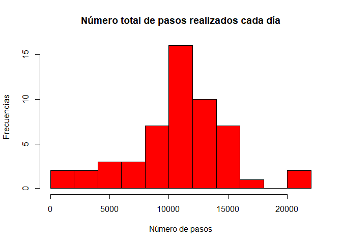
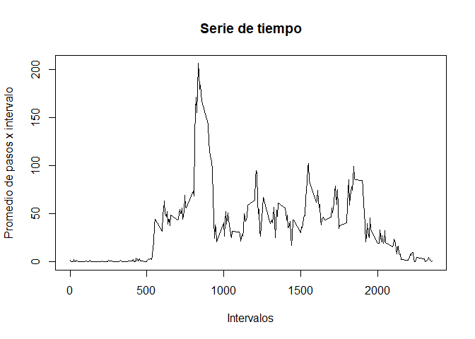
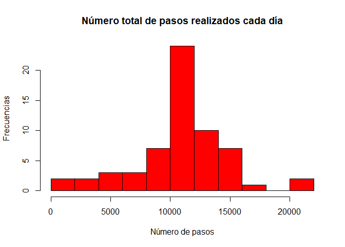
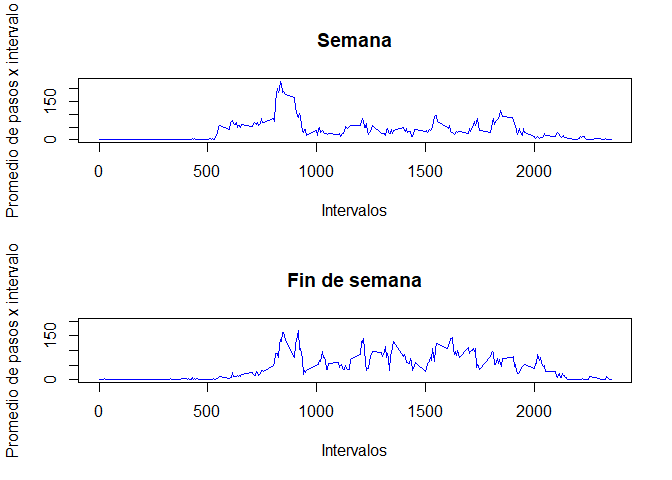

## Project week 2

It is now possible to collect a large amount of data about personal movement using activity monitoring devices such as a Fitbit, Nike Fuelband, or Jawbone Up. These type of devices are part of the "quantified self" movement -- a group of enthusiasts who take measurements about themselves regularly to improve their health, to find patterns in their behavior, or because they are tech geeks. But these data remain under-utilized both because the raw data are hard to obtain and there is a lack of statistical methods and software for processing and interpreting the data.

This assignment makes use of data from a personal activity monitoring device. This device collects data at 5 minute intervals through out the day. The data consists of two months of data from an anonymous individual collected during the months of October and November, 2012 and include the number of steps taken in 5 minute intervals each day.

With the recorded data a basic exploratory analysis will be made to see if we can find any pattern in the movement of this anonymous person and the questions posed by the teacher will be answered.

1. Load the data (i.e. \color{red}{\verb|read.csv()|}read.csv())


```r
install.packages("dplyr")
library(dplyr)
pasos = read.csv("activity.csv")
```
2. Process/transform the data (if necessary) into a format suitable for your analysis.


```r
suma_total = pasos
suma_total = suma_total[!is.na(suma_total$steps),]
suma_total = group_by(suma_total, date)
suma_total = summarise(suma_total, sum(steps))
```

```
## `summarise()` ungrouping output (override with `.groups` argument)
```

## What is mean total number of steps taken per day?
For this part of the assignment, you can ignore the missing values in the dataset.

1. Calculate the total number of steps taken per day


```r
sum(suma_total$`sum(steps)`)
```

```
## [1] 570608
```

2. If you do not understand the difference between a histogram and a barplot, research the difference between them. Make a histogram of the total number of steps taken each day


```r
hist(suma_total$`sum(steps)`, xlab = "Número de pasos", ylab= "Frecuencias", main = "Número total de pasos realizados cada día", breaks = "Freedman-Diaconis", col = "red")
```

<!-- -->

3. Calculate and report the mean and median of the total number of steps taken per day


```r
summary(suma_total)
```

```
##      date             sum(steps)   
##  Length:53          Min.   :   41  
##  Class :character   1st Qu.: 8841  
##  Mode  :character   Median :10765  
##                     Mean   :10766  
##                     3rd Qu.:13294  
##                     Max.   :21194
```

## What is the average daily activity pattern?

1. Make a time series plot (i.e. \color{red}{\verb|type = "l"|}type = "l") of the 5-minute interval (x-axis) and the average number of steps taken, averaged across all days (y-axis)


```r
## promedio de pasos por intervalos. Los cálculos ignoran los valores faltantes.
promedios = tapply(pasos$steps, list(pasos$interval), mean, na.rm=TRUE)
original = unique(pasos$interval)
promedios=as.data.frame(promedios)
promedios=cbind(original, promedios)
promedios= rename(promedios, Int_orig = original, Mean = promedios) ## se cambia el nombre de las columnas.
##serie de tiempo de los pasos por intervalos.
plot(x = promedios$Int_orig, y = promedios$Mean, type = "l", xlab = "Intervalos", ylab = "Promedio de pasos x intervalo", main = "Serie de tiempo")
```

<!-- -->

2. Which 5-minute interval, on average across all the days in the dataset, contains the maximum number of steps?


```r
filter(promedios, Mean == max(promedios$Mean))
```

```
##     Int_orig     Mean
## 835      835 206.1698
```

## Imputing missing values

Note that there are a number of days/intervals where there are missing values (coded as \color{red}{\verb|NA|}NA). The presence of missing days may introduce bias into some calculations or summaries of the data.

1. Calculate and report the total number of missing values in the dataset (i.e. the total number of rows with \color{red}{\verb|NA|}NAs)


```r
## identificando valores faltantes por columnas.
faltantes_steps = sum(is.na(pasos$steps))/length(pasos$steps)
faltantes_date = sum(is.na(pasos$date))
faltantes_interval = sum(is.na(pasos$interval))

## un 13% de valores faltantes.
faltantes_steps 
```

```
## [1] 0.1311475
```

```r
faltantes_date
```

```
## [1] 0
```

```r
faltantes_interval
```

```
## [1] 0
```

2. Devise a strategy for filling in all of the missing values in the dataset. The strategy does not need to be sophisticated. For example, you could use the mean/median for that day, or the mean for that 5-minute interval, etc.

The missing values will be replaced by the interval average.


3. Create a new dataset that is equal to the original dataset but with the missing data filled in.


```r
##reemplazar valores faltantes por el promedio de pasos del intervalo.
pasos_vf = pasos
for (i in 1:length(pasos_vf$steps)){
        if(is.na(pasos_vf$steps[i])){
                for(j in 1:length(promedios$Int_orig)){
                        if(pasos_vf$interval[i] == promedios$Int_orig[j]){
                                pasos_vf$steps[i] = promedios$Mean[j]
                                j=300
                        }
                        
                }
        }
}
```

4.Make a histogram of the total number of steps taken each day and Calculate and report the mean and median total number of steps taken per day. Do these values differ from the estimates from the first part of the assignment? What is the impact of imputing missing data on the estimates of the total daily number of steps?

The results don't really change that much. The data is only a little more concentrated around the mean.


```r
suma_total_vf = pasos_vf
suma_total_vf = group_by(suma_total_vf, date)
suma_total_vf = summarise(suma_total_vf, sum(steps))
```

```
## `summarise()` ungrouping output (override with `.groups` argument)
```

```r
hist(suma_total_vf$`sum(steps)`, xlab = "Número de pasos", ylab= "Frecuencias", main = "Número total de pasos realizados cada día", breaks = "Freedman-Diaconis", col ="red")
```

<!-- -->

The mean and median do not change


```r
summary(suma_total_vf)
```

```
##      date             sum(steps)   
##  Length:61          Min.   :   41  
##  Class :character   1st Qu.: 9819  
##  Mode  :character   Median :10766  
##                     Mean   :10766  
##                     3rd Qu.:12811  
##                     Max.   :21194
```


## Are there differences in activity patterns between weekdays and weekends?

For this part the \color{red}{\verb|weekdays()|}weekdays() function may be of some help here. Use the dataset with the filled-in missing values for this part.

1. Create a new factor variable in the dataset with two levels – “weekday” and “weekend” indicating whether a given date is a weekday or weekend day.


```r
#agregar una columna con el nombre del día para poder identificar si es día de semana o fin de semana. Se utiliza la base nueva que contiene los valores faltantes reemplazados.
pasos_vf = cbind(weekdays(as.Date(pasos_vf$date)), pasos_vf)
pasos_vf = rename(pasos_vf, Dia = "weekdays(as.Date(pasos_vf$date))", Pasos = steps, Fecha = date, Intervalo = interval)

## separo la base de datos por fin de semana y semana.
semana = filter(pasos_vf, Dia %in% c("lunes", "martes", "miércoles", "jueves", "viernes"))
findesemana = filter(pasos_vf, Dia %in% c("sábado", "domingo"))

##promedios por semana y fin de semana
promedios_semana = semana
promedios_semana = group_by(promedios_semana, Intervalo)
promedios_semana = summarise(promedios_semana, mean(Pasos))
```

```
## `summarise()` ungrouping output (override with `.groups` argument)
```

```r
promedios_findesemana = findesemana
promedios_findesemana = group_by(promedios_findesemana, Intervalo)
promedios_findesemana = summarise(promedios_findesemana, mean(Pasos))
```

```
## `summarise()` ungrouping output (override with `.groups` argument)
```

2. Make a panel plot containing a time series plot (i.e. \color{red}{\verb|type = "l"|}type = "l") of the 5-minute interval (x-axis) and the average number of steps taken, averaged across all weekday days or weekend days (y-axis). See the README file in the GitHub repository to see an example of what this plot should look like using simulated data.


```r
par(mfrow=c(2,1))
plot(x = promedios_semana$Intervalo, y = promedios_semana$`mean(Pasos)`, type = "l", xlab = "Intervalos", ylab = "Promedio de pasos x intervalo", main = "Semana", col = "blue" )
plot(x = promedios_findesemana$Intervalo, y = promedios_findesemana$`mean(Pasos)`, type = "l", xlab = "Intervalos", ylab = "Promedio de pasos x intervalo", main = "Fin de semana", col = "blue", ylim = c(0, 200))
```

<!-- -->


